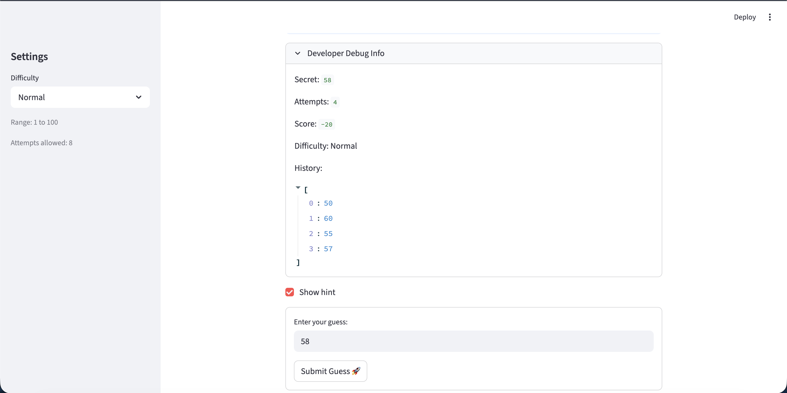

# 🎮 Game Glitch Investigator: The Impossible Guesser

## 🚨 The Situation

You asked an AI to build a simple "Number Guessing Game" using Streamlit.
It wrote the code, ran away, and now the game is unplayable. 

- You can't win.
- The hints lie to you.
- The secret number seems to have commitment issues.

## 🛠️ Setup

1. Install dependencies: `pip install -r requirements.txt`
2. Run the broken app: `python -m streamlit run app.py`

## 🕵️‍♂️ Your Mission

1. **Play the game.** Open the "Developer Debug Info" tab in the app to see the secret number. Try to win.
2. **Find the State Bug.** Why does the secret number change every time you click "Submit"? Ask ChatGPT: *"How do I keep a variable from resetting in Streamlit when I click a button?"*
3. **Fix the Logic.** The hints ("Higher/Lower") are wrong. Fix them.
4. **Refactor & Test.** - Move the logic into `logic_utils.py`.
   - Run `pytest` in your terminal.
   - Keep fixing until all tests pass!

## 📝 Document Your Experience

- [ ] Describe the game's purpose.
A number guessing game built with Streamlit. The player picks a difficulty, then tries to guess a secret number within a limited number of attempts. Each wrong guess costs 5 points; guessing correctly awards a bonus that shrinks with each attempt, rewarding efficiency.

- [ ] Detail which bugs you found.
### Bugs Found
1. Reversed hint messages in `check_guess`
2. Entry key did nothing -  Pressing Enter in the text input triggered a page rerun but never processed the guess.
3. New game ignored difficulty - `random.randint(1, 100)` was hardcoded, ignoring Easy (1–20) and Hard (1–50) ranges.
4. Off-by-one in attempts - `attempts` started at `1` instead of `0`.
5. Sidebar shows "1 and 100" regardless of the selected difficulty.

- [ ] Explain what fixes you applied.
### Fixes Applied
1. Swapped the hint messages in `check_guess()` so each outcome returns the correct direction.
2. Wrapped `st.text_input` and the submit button in `st.form` / `st.form_submit_button` so Enter triggers submission.
3. Added `status`, `score`, and `history` resets inside the `if new_game:` block.
4. Changed `random.randint(1, 100)` to `random.randint(low, high)` using the difficulty-aware range.
5. Changed `st.session_state.attempts = 1` to `= 0`.
6. Replaced the hardcoded string with `f"Guess a number between {low} and {high}."`.

## 📸 Demo

## 🚀 Stretch Features

- [ ] [If you choose to complete Challenge 4, insert a screenshot of your Enhanced Game UI here]
